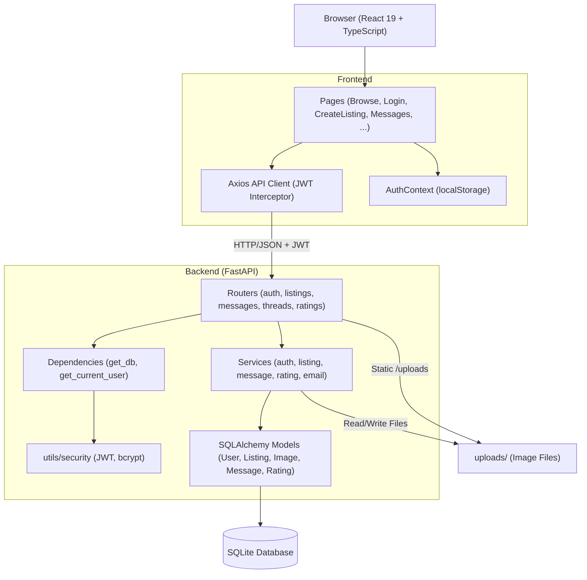

# Architecture Overview

High-level layered architecture of YUTrade showing frontend, backend layers, and data stores.

```mermaid
flowchart TD
    Browser["Browser (React 19 + TypeScript)"]

    subgraph Frontend
        Pages["Pages (Browse, Login, CreateListing, Messages, ...)"]
        ApiClient["Axios API Client (JWT Interceptor)"]
        AuthCtx["AuthContext (localStorage)"]
    end

    subgraph Backend["Backend (FastAPI)"]
        Routers["Routers (auth, listings, messages, threads, ratings)"]
        Services["Services (auth, listing, message, rating, email)"]
        Deps["Dependencies (get_db, get_current_user)"]
        Security["utils/security (JWT, bcrypt)"]
        Models["SQLAlchemy Models (User, Listing, Image, Message, Rating)"]
    end

    SQLite[(SQLite Database)]
    Uploads["uploads/ (Image Files)"]

    Browser --> Pages
    Pages --> ApiClient
    Pages --> AuthCtx
    ApiClient -->|"HTTP/JSON + JWT"| Routers
    Routers --> Deps
    Deps --> Security
    Routers --> Services
    Services --> Models
    Models --> SQLite
    Services -->|"Read/Write Files"| Uploads
    Routers -->|"Static /uploads"| Uploads
```
