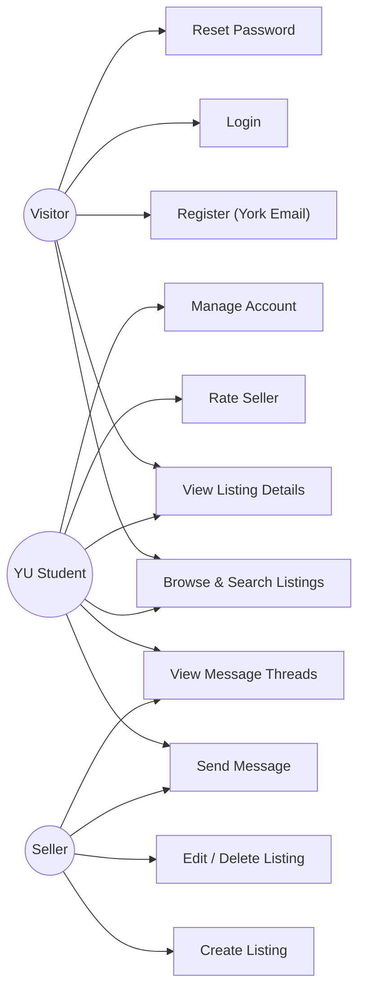

# Use Case Diagram

Actors and their primary interactions with the YUTrade system.

```mermaid
flowchart LR
    Visitor(("Visitor"))
    Student(("YU Student"))
    Seller(("Seller"))

    Browse["Browse & Search Listings"]
    ViewListing["View Listing Details"]
    Register["Register (York Email)"]
    Login["Login"]
    ResetPwd["Reset Password"]
    CreateListing["Create Listing"]
    EditListing["Edit / Delete Listing"]
    SendMsg["Send Message"]
    ViewThreads["View Message Threads"]
    RateSeller["Rate Seller"]
    ManageAccount["Manage Account"]

    Visitor --> Browse
    Visitor --> ViewListing
    Visitor --> Register
    Visitor --> Login
    Visitor --> ResetPwd

    Student --> Browse
    Student --> ViewListing
    Student --> SendMsg
    Student --> ViewThreads
    Student --> RateSeller
    Student --> ManageAccount

    Seller --> CreateListing
    Seller --> EditListing
    Seller --> SendMsg
    Seller --> ViewThreads
```
