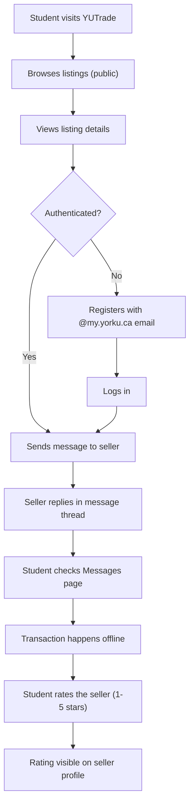

# Key User Story Flow

End-to-end journey: a student registers, browses listings, contacts a seller, and rates the transaction.

```mermaid
flowchart TD
    A["Student visits YUTrade"] --> B["Browses listings (public)"]
    B --> C["Views listing details"]
    C --> D{"Authenticated?"}
    D -->|No| E["Registers with @my.yorku.ca email"]
    E --> F["Logs in"]
    D -->|Yes| G["Sends message to seller"]
    F --> G
    G --> H["Seller replies in message thread"]
    H --> I["Student checks Messages page"]
    I --> J["Transaction happens offline"]
    J --> K["Student rates the seller (1-5 stars)"]
    K --> L["Rating visible on seller profile"]
```
