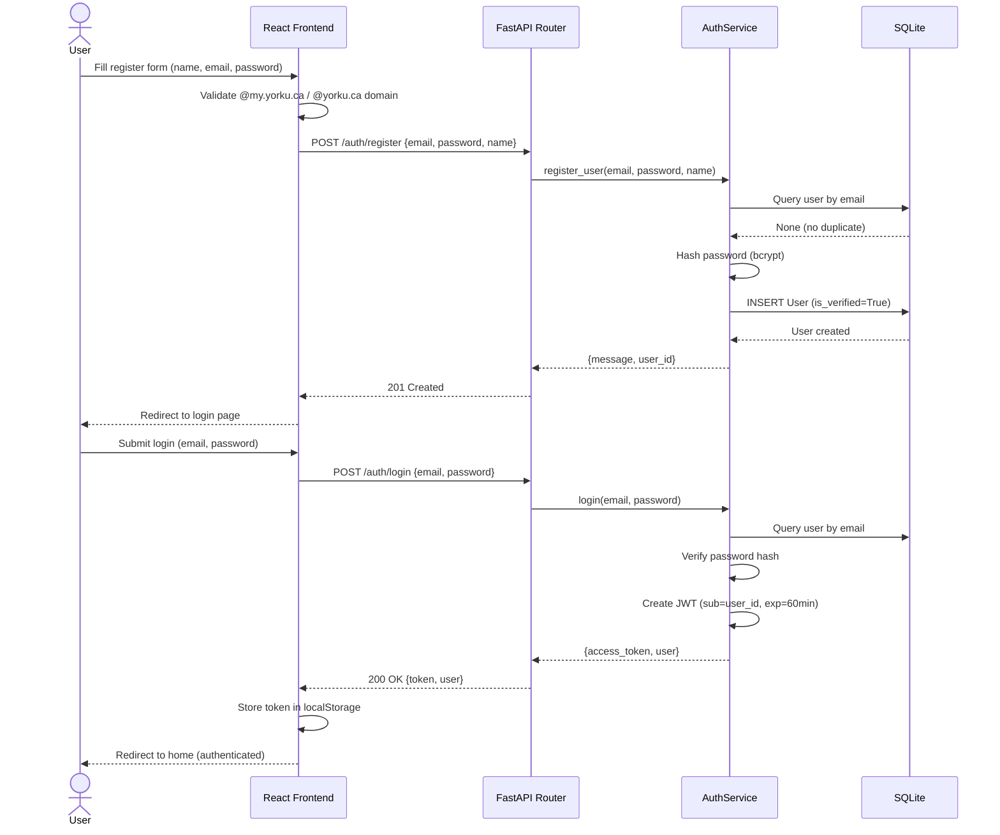

# Registration Sequence

Sequence diagram for user registration with York email validation.

```mermaid
sequenceDiagram
    actor User
    participant FE as React Frontend
    participant API as FastAPI Router
    participant Svc as AuthService
    participant DB as SQLite

    User->>FE: Fill register form (name, email, password)
    FE->>FE: Validate @my.yorku.ca / @yorku.ca domain
    FE->>API: POST /auth/register {email, password, name}
    API->>Svc: register_user(email, password, name)
    Svc->>DB: Query user by email
    DB-->>Svc: None (no duplicate)
    Svc->>Svc: Hash password (bcrypt)
    Svc->>DB: INSERT User (is_verified=True)
    DB-->>Svc: User created
    Svc-->>API: {message, user_id}
    API-->>FE: 201 Created
    FE-->>User: Redirect to login page
    User->>FE: Submit login (email, password)
    FE->>API: POST /auth/login {email, password}
    API->>Svc: login(email, password)
    Svc->>DB: Query user by email
    Svc->>Svc: Verify password hash
    Svc->>Svc: Create JWT (sub=user_id, exp=60min)
    Svc-->>API: {access_token, user}
    API-->>FE: 200 OK {token, user}
    FE->>FE: Store token in localStorage
    FE-->>User: Redirect to home (authenticated)
```
