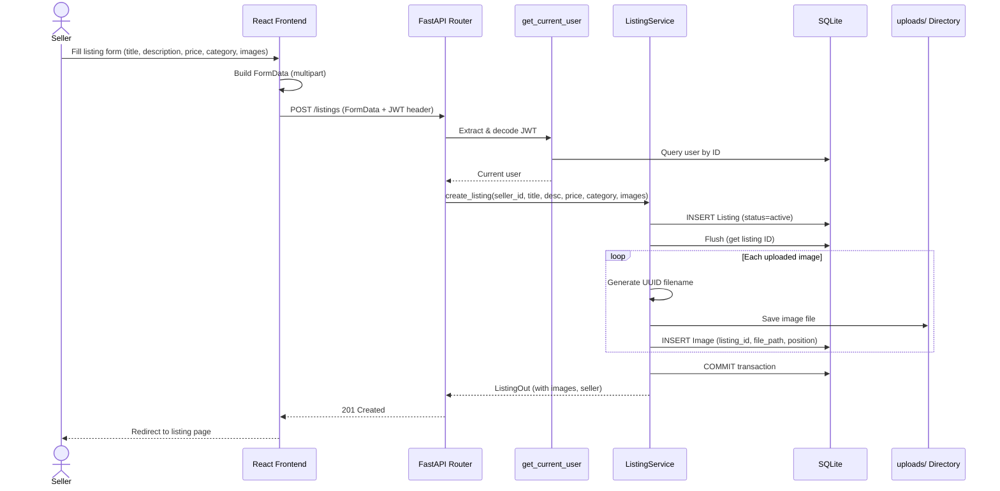

# Create Listing Sequence

Sequence diagram for creating a new listing with image uploads.

```mermaid
sequenceDiagram
    actor Seller
    participant FE as React Frontend
    participant API as FastAPI Router
    participant Auth as get_current_user
    participant Svc as ListingService
    participant DB as SQLite
    participant Disk as uploads/ Directory

    Seller->>FE: Fill listing form (title, description, price, category, images)
    FE->>FE: Build FormData (multipart)
    FE->>API: POST /listings (FormData + JWT header)
    API->>Auth: Extract & decode JWT
    Auth->>DB: Query user by ID
    Auth-->>API: Current user
    API->>Svc: create_listing(seller_id, title, desc, price, category, images)
    Svc->>DB: INSERT Listing (status=active)
    Svc->>DB: Flush (get listing ID)
    loop Each uploaded image
        Svc->>Svc: Generate UUID filename
        Svc->>Disk: Save image file
        Svc->>DB: INSERT Image (listing_id, file_path, position)
    end
    Svc->>DB: COMMIT transaction
    Svc-->>API: ListingOut (with images, seller)
    API-->>FE: 201 Created
    FE-->>Seller: Redirect to listing page
```
