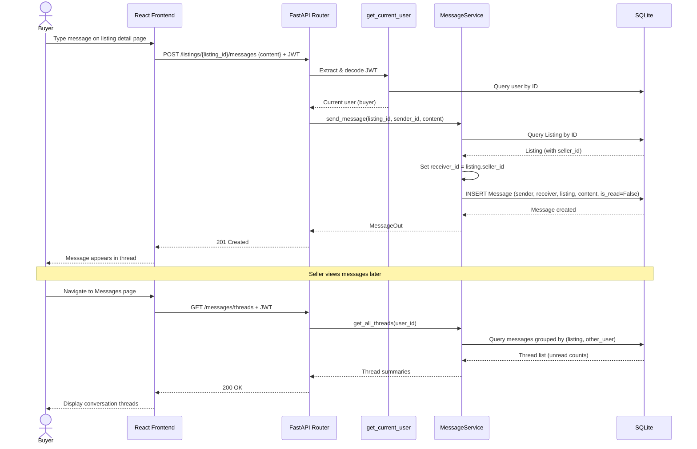

# Send Message Sequence

Sequence diagram for a buyer sending a message to a seller about a listing.

```mermaid
sequenceDiagram
    actor Buyer
    participant FE as React Frontend
    participant API as FastAPI Router
    participant Auth as get_current_user
    participant Svc as MessageService
    participant DB as SQLite

    Buyer->>FE: Type message on listing detail page
    FE->>API: POST /listings/{listing_id}/messages {content} + JWT
    API->>Auth: Extract & decode JWT
    Auth->>DB: Query user by ID
    Auth-->>API: Current user (buyer)
    API->>Svc: send_message(listing_id, sender_id, content)
    Svc->>DB: Query Listing by ID
    DB-->>Svc: Listing (with seller_id)
    Svc->>Svc: Set receiver_id = listing.seller_id
    Svc->>DB: INSERT Message (sender, receiver, listing, content, is_read=False)
    DB-->>Svc: Message created
    Svc-->>API: MessageOut
    API-->>FE: 201 Created
    FE-->>Buyer: Message appears in thread

    Note over Buyer,DB: Seller views messages later
    Buyer->>FE: Navigate to Messages page
    FE->>API: GET /messages/threads + JWT
    API->>Svc: get_all_threads(user_id)
    Svc->>DB: Query messages grouped by (listing, other_user)
    DB-->>Svc: Thread list (unread counts)
    Svc-->>API: Thread summaries
    API-->>FE: 200 OK
    FE-->>Buyer: Display conversation threads
```
